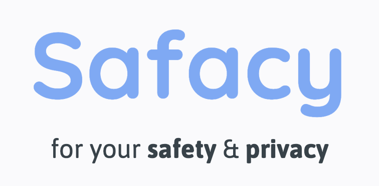
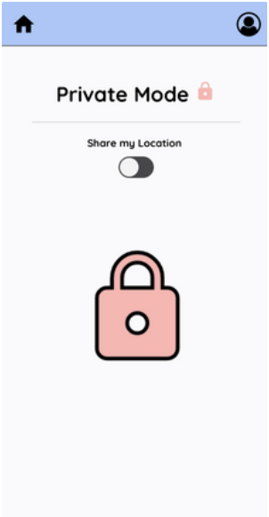
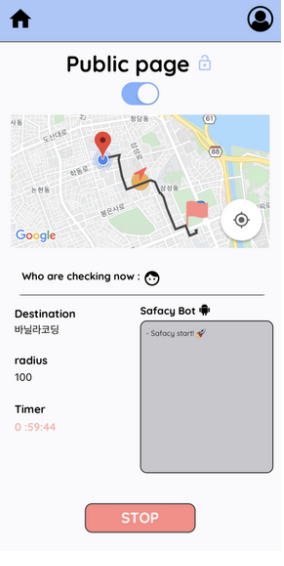

# SAFACY 🔐 - safe + privacy



✅ Safe하고 싶지만, 나의 Privacy도 중요한 유저를 위한 앱

✅ 자주 연락하기 어려운 학생, 직장인들을 위한 위치공유 안심 서비스

모든 위치를 공유하는 앱을 사용하던 시절 지정된 시간에만 지정한 친구에게만 나의 위치를 공유하면 좋겠다 라는 경험을 기반으로,  
Safety(안심)과 Privacy(개인정보)를 모두 충족시킬 수 있는 서비스 Safacy 앱을 기획하게 되었습니다.

#

### `📆 전체 일정`

**STEP 1. 기획** (2022.02.21 ~ 2021.02.27)

- 아이디어 브레인 스토밍
- 기획 : [KANBAN](https://www.notion.so/KANBAN-47c02f609fe64356a70725e1af3116f2)
- 목업 : [MOQUPS](https://app.moqups.com/jnrQ3UoEeDt8ARcn8QzwxsrVMODKMW1D/view/page/abd5b553e)
- Schema : [LUCIDE CHART](https://lucid.app/lucidchart/376e21f8-ec98-4572-a510-802917ec0dbf/edit?invitationId=inv_739dd0c1-a2d0-4a2a-a300-183c0ad96d54)

**STEP 2. 개발 및 배포** (2022.02.28 ~ 2021.03.11)

- 기능 구현
- Test code / README 작성
- FE/BE 배포

#

### `🛠 Tech stack`

**FrontEnd**

- React-native (expo)
- React Navigation (v6)
- Redux
- Redux-toolkit
- Redux-thunk
- socket.io-client
- Google Maps API

**BackEnd**

- Node JS
- Express
- MongoDB, Mongoose
- Socket.io

**Testing**

- FrontEnd: jest
- BackEnd : supertest, jest

#

### `📌 프로젝트 설명`

**Private & Public Mode로 구성되어 있습니다.**






- **PRIVATE PAGE**  
  위치가 공유되지 않는 상태입니다.
  Share my Location을 활성화시키면, Safacy 앱의 메인 기능인 Public Mode로 전환됩니다.

- **SETTING PAGE**  
  Public Mode가 활성화 되면, 이동하려는 Destination (현재위치도 가능), 허용 가능한 Radius, 소요 시간 Time, 공유할 Friends 를 설정하고 Start버튼을 누르면 Public Mode가 시작됩니다.

- **PUBLIC PAGE**  
  유저의 위치가 공유되는 상태입니다. 유저의 위치 상태에 따라 SafacyBot 은 알람을 보내게 되고, SafacyBot 채팅창에 나타납니다. SafacyBot이 알람을 보내면 공유받은 친구는 push notification을 받게 됩니다. 자세한 SafacyBot의 동작 원리는 아래 링크를 확인해주세요.  
  [🤖 SAFACYBOT ALGORITHM](https://www.notion.so/d76a615fd2f54532909704de3d30d133)

- **FRIEND SAFACY**  
  친구가 공유한 페이지와 같은 지도 & 설정이 보이며, 실시간으로 이동하는 친구의 위치를 확인할 수 있습니다. 만일 SafacyBot의 알람메시지에 따른 위험을 감지하게 되었을 때 SOS 버튼을 통해, 현재 친구의 위치를 119에 문자로 전송하여 구조요청을 할 수 있습니다.

#

### `🏷 How to use`

**FrontEnd**

- 프로젝트 root 디렉토리에 .env.local파일을 생성한 후, 아래 형식에 맞게 환경변수 값 설정

  ```(javascript)
  will be updated soon
  ```

**BackEnd**

- 프로젝트 root 디렉토리에 .env파일을 생성한 후, 아래 형식에 맞게 환경변수 값 설정

  ```(javascript)
  will be updated soon
  ```

#

### `💡 My Topics`

- <U>React native</U>
- <U>React native - Navigation</U>
- <U>Redux-thunk</U>
- <U>지도 구현 & location sharing</U>
- <U>custom hook & component</U>

#

### `🔖 프로젝트를 마친 소감`

**기획단계 - 설렘 가득, 불안감도 함께**

이전부터 앱 App을 개발해보고 싶었기에 기획 (아이디어, 칸반, 목업, 스키마)하는 순간순간이 설렘으로 가득했습니다. 여러 아이디어들이 샘솟듯이 떠올랐고, 구현된 저의 App을 상상하며 공부하는 시간이 즐겁게 느껴졌습니다. 하지만 홀로서기의 시작! “내가 구현할 수 있을까? 혼자 할 수 있을까?” 라는 생각과 함께 불안감이 공존하는 시간이었습니다. 상상만 해오던 기능들을 구현할 수 있을지, web과 다른 점에서 오는 러닝커브가 높지 않을지 등등 이런 생각과 함께 개발단계를 시작하게 되었습니다.

**개발단계 - 험난했지만, 벽을 부수는 만족감, 그래도 해보자!**

역시나 기획단계부터 예상했던 많은 난관이 있었습니다. 혼자서 해결해야 한다는 책임감과 함께 구현하지 못했을 때의 걱정이 반복되었습니다. 어려움을 겪을 때마다 켄님, 멘토님들, 팀프로젝트 팀원들이 많은 힘을 주었던 것이 생각났고, 마음이 약해지는 시기가 있었습니다.

하지만 “그래도 해보자!"라는 생각으로 차근차근 해나갔습니다. 그리고 Task라는 벽을 깨부순다는 느낌이 들어서 만족감도 크게 느껴졌습니다. 한단계 나갈때마다 큰 벽이 있었지만, 그동안 바닐라코딩의 부트캠프 기간동안 배웠던 지식, 문제 해결 능력이 적극 발휘되는 시기였다고 생각합니다.

**아쉬움**

이번 프로젝트에서 저의 목표는 **완성도** 였습니다. 그래서 기획에 많은 노력을 들였습니다. 하지만 생각하지 못한 다양한 기술적, 기획적 변수들이 존재했고, 유저들의 입장에서 불편함을 느낄 수 있는 여러 에러들이 발생했습니다. 그렇게 Schema 구조가 처음 기획에서 달라지고, 백엔드를 전반적으로 수정해야하는 일이 발생했습니다. 예상하지 못한 기획변경으로 소요된 시간이 많았고, 세밀한 에러 핸들링이 되지 않은 점에 아쉬움이 남습니다. 하지만 이런 경험이 다음 프로젝트 기획단계에서 미리 고려할 항목이 될 것이라 생각합니다.
